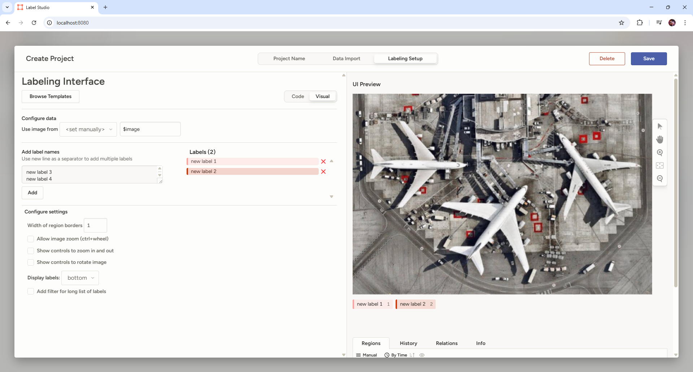

# Object-Detection-Name-Tag
Method used: Data Labeling, YOLO model, python, pytorch, opencv 

Software used: Label Studio, Google Collab, PyCharm

Task: 
1. Identify which frames in the clip have the staff present? 
2. [Bonus] Locate the staff xy coordinates when present in the clip. 

Label Studio Link:
https://labelstud.io/

## Step 1: Data Label
1. In PyCharm, install and launch label studio:

        # Install the package
        # into python virtual environment
        pip install -U label-studio
        # Launch it!
        label-studio
2. Register, Create Project

3. Enter Project name, import data, labeling setup: Object Detection with Bounding boxes
4. Remove the default label options and input desired label options, then press "Add"
5. Save
6. Click into any of the image data imported, start labeling (press 1,2,3/ any options and start to drag a box, then press submit)
7. After labeling, press "Export", then choose "YOLO with images"
8. Download the folder
9. Rename the folder to Data.zip

## Step 2: Training YOLO Model
1. In Google Collab, press "Runtime", "Change runtime type", "T4 GPU", Connect
2. Click folder at left side, drag and drop Data.zip to upload.
3. Run all cell in Name Tag Detection.ipynb or copy cell by cell and run
4. Snapshots:

5. Download the trained model by running the final cell in Name Tag Detection.ipynb

## Step 3: Run trained Model to detect Staff and Staff Name Tag
1. In PyCharm, navigate to the model folder (my_model if u didn't remane)
2. Make sure the sample.mp4 is inside my_model folder, same folder with name_tag.py
3. Download or curl my python file: name_tag.py
4. Right click the model folder and open terminal. 
5. Install packages: 

        pip install ultralytics
6. Get latest pytorch with this link: https://pytorch.org/get-started/locally/

        pip3 install --upgrade torch torchvision torchaudio --index-url https://download.pytorch.org/whl/cu128
7. Parse the video to python code:

        python name_tag.py --model my_model.pt --source sample.mp4
8. Controls: "Q" to quit, "S" to Stop, "P" to take Screenshot
